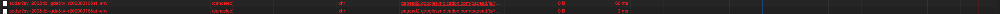

# shri_homework_dev_tools

## Network

### HAR
* [профиль загрузки ресурсов в HAR](lifehacker.ru.har)

### дублирование ресурсов
* > файл `publishertag.js` грузится 2 раза
  > 
* > подключение Google Tag Manager с разным id выглядит странно..
  > 
* > рекламные скрипты подгружаются дважды
  > 

### лишний размер ресурса
* > шрифты грузятся для многих языков сразу, хотя на странице вряд ли они используются все. Также одновременно для шрифтов грузится расширенная версия и обычная(например, `cyrillic-ext` и `cyrillic`).
  > 

### медленно загружающиеся ресурсы
* > большие изображения, размер которых точно можно соптимизировать
  > 

### ресурсы, блокирующие загрузку
* > 60 ресурс блокирует загрузку
  > 
  >
  > при чём некоторые из этих ресурсов совсем необязательные для загрузки в `head` – например скрипты для аналитики обычно подключаются в конце `body`, чтобы не блокировать загрузку страницы
  > 

### дополнительно
* [в google-шрифтах не используется font-display](https://scotch.io/bar-talk/google-fonts-now-supports-font-display#toc-how-do-i-use-font-display-with-google-fonts-)
* > какие-то 2 запроса были отклонены
  > 
* > много закомментированного кода, например в `index.html`:
  > 

---

## Performance

### профиль загрузки страницы
* [файл профиля загрузки страницы](Profile-20200322T231809.json)

### время в миллисекундах от начала навигации до:
* First Paint: 3806.7 ms
* First Meaningful Paint: 3806.7 ms
* DOM Content Loaded: 4260.4 ms
* Load: 10846.5 ms

### время в миллисекундах на разные этапы обработки документа:
* Loading: 89 ms
* Scripting: 3539 ms
* Rendering: 889 ms
* Painting: 66 ms

---

## Coverage

### скриншот вкладки после загрузки страницы

### объём неиспользованного CSS:
* 391 KB unused

### объём неиспользованного JS:
* 2.3 MB unused